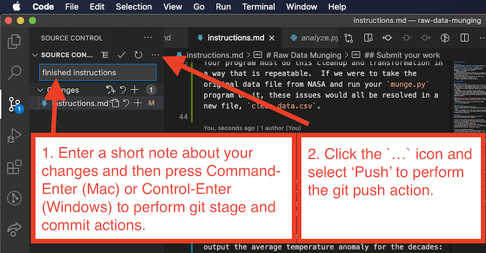

# Math Education App

You have decided to create an education app that elementary school teachers can use to help teach their students learn addition and subtraction.

The app will allow students to virtually roll two dice. The values of the dice will be displayed to the students, and the app will then ask students to input either the sum of the two dice or the difference between the two dice. Students are told whether their answer was correct or not.

- A file named [app_functions.py](./app_functions.py) contains functions used by this app - you will need to complete these functions according to the documentation contained within this file.
- To run the program, run the file named [main.py](./main.py) - you will have to complete this function according to the documentation contained within this file.

## Clone this repository

First, clone this repository to your local computer, using Visual Studio Code's cloning feature.

Helpful video:

- [cloning a code repository from GitHub to your local machine](https://www.youtube.com/watch?v=axcny0o1NYo).

## Set up Visual Studio Code

Once cloned, set Visual Studio Code to be suitable for Python development using the "command palette":

- set the interpreter to a Python 3.x interpreter, such as that by [`Anaconda`](https://www.anaconda.com/).
- set the linter to by `pylint`.
- set the test framework to be `pytest`.

Helpful video:

- [Setting up Visual Studio Code for Python development](https://www.youtube.com/watch?v=xsXMzyK1M4I)

## Modify the code

The files named `app_functions.py` and `main.py` contain several functions that must be completed in order for the program to work. Each function contains a description of what it should do.

The only modifications you must make in order to complete this assignment are to these two files.

### Run the program

To run the program, run the file named `main.py`. Running the `main.py` program should make use of the functions defined in `app_functions.py` file. Review the output in a variety of different contexts to make sure it is always correct, according to the instructions and documentation.

### Verify that the tests pass

Pytest-based tests are included in the `tests` directory that will help you determine whether each function is operating as expected. If the functions have been completed correctly, all tests should pass. You should not modify any files in the `tests` directory.

Run the tests using Visual Studio Code's Tests panel.

If the tests do not appear, or seem to never stop loading, open up a Terminal window and run the command, `pytest --collect-only`, to see whether there are any errors in the code that prevent the tests from being discovered.

## Submit your work

Each student must submit this assignment individually. Use Visual Studio Code to perform git `stage`, `commit` and `push` actions to submit. These actions are all available as menu items in Visual Studio Code's Source Control panel.

1. Type a short note about what you have done to the files in the `Message` area, and then type `Command-Enter` (Mac) or `Control-Enter` (Windows) to perform git `stage` and `commit` actions.
1. Click the `...` icon next to the words, "Source Control" and select "Push" to perform the git `push` action. This will upload your work to your repository on GitHub.com.

